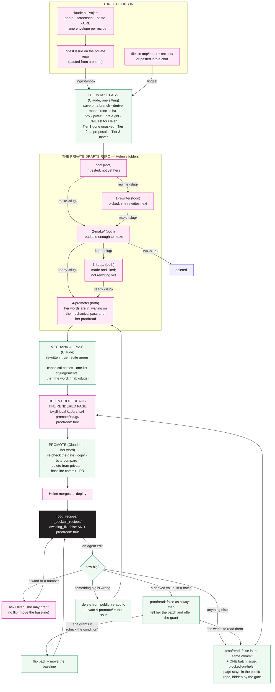

# PIPELINE — how a recipe gets in, gets Helen's words, gets out, and comes back

Written 2026-09-14 for #1008, Helen: *"I want this process to be as smooth as
possible. We've reinvented this hundreds of ways together recently, which is
laborious and inefficient."* This is the one map. The five documents that used
to hold pieces of it still hold the DETAIL of their own step and point here for
the journey: `.claude/commands/ingest.md` (the ingest contract, the tiers, the
`QQ` shapes), `ingest-inbox.md` (the envelope consumer), `tidy-drafts.md` (the
formatting pass), `PUBLISHING_A_DRINK.md` (the promotion steps, the word
"final"), `CLAUDE_WEB_INGEST.md` (the claude.ai Project). MANUAL §4.0 and §9.1.1
say what the flags MEAN and this file does not restate them.

**Two things carry state, and they answer different questions.** The
**folders** in the private drafts repo record where HELEN is with a file, and
she can move a file between them herself at any time. The **flags** in a
file's `meta:` block record what the SUITE and the publish gate may assume,
and an agent writes them only where this document says. A folder is never
inferred from a flag and a flag is never inferred from a folder.

---

## 1. The picture

Pink is Helen, green is Claude, violet is a machine step, black is live.

---

## 2. Three doors in, one intake pass

Helen sends material three ways and the difference is TRANSPORT only:

| door | what arrives | who runs what |
|---|---|---|
| the claude.ai Project (`CLAUDE_WEB_INGEST.md`) | one envelope per recipe: the complete file plus a "what I could not know" list plus a fingerprint | Helen pastes each envelope into an `ingest` issue on the matching PRIVATE repo, or into the chat |
| an `ingest` issue on the private repo | the envelope, as text | Claude: `/ingest-inbox` — `scripts/ingest_inbox.py` parses, deduplicates by fingerprint, writes the file, never repairs |
| files in `tmp/inbox-food-recipes/` or `tmp/inbox-cocktail-recipes/`, or a paste | photographs, screenshots, text | Claude: `/ingest` — transcribe by opening every capture |

Whichever door, **the same intake pass runs once, in one sitting, and ends in
ONE list for Helen.** In order: save the file on a branch of the private repo
(never its `main`); for a cocktail recipe, `python3 scripts/derive_cocktail_moods.py
--write`; `/tidy-drafts` if the quoting or typography needs it; `pytest`;
`python3 scripts/ingest_preflight.py`; then the list — every rejection, every
probable duplicate, every hand-back bullet, every undeclared bottle, grouped by
decision. Not a question at a time: a gap found on the fourth recipe is one line
Helen reads once.

**What is transformed at intake, without asking** (`ingest.md` TIER 1 is the
authority; this is the summary):

- house style outside `QQ` lines — en dashes, `°C`, fractions, quoting, accents;
- every qualifier the source states (sugar, butter, eggs, milk…), the fan
  figure, quantities in `amount:` with their size words, `serves_estimate:`
  on a food recipe whose `serves:` does not open with a number;
- `ingredient_groups` and `method_groups` split once, here, with the same names;
- the citation per `SOURCE_ATTRIBUTION_SPEC.md`; the slug from the whole title;
- **food: every method step as a `QQ original` / `QQ Claude` pair** — the
  verbatim line kept untidied, the paraphrase held to house style;
- **cocktails: millilitres, canonical method steps, `serve.ice` rather than a
  step, no `Express…` step, `generic` typed only on an exact match in the
  vocabulary and otherwise `QQ` plus the source's own words, `suggestion: []`**,
  moods derived.

**What is never transformed**: anything in Helen's head. Her VOICE — every
tagline an ingest writes begins `QQ `, on both sites, because the line carries
her name on a published page. `meta.ship`, `meta.rewritten`, `meta.proofread`, a
bottle nobody declared, a category the vocabulary does not settle, a
reconstruction of a truncated step. A silence in the source is `QQ`, never a
default.

---

## 3. The folders, and the four words that move a file

The private repo's subfolders are Helen's: they record where she is with a
file, which no flag can say. Since 2026-09-14 both sites use the same set,
**numbered in pipeline order so they sort to the top of her file list in the
order a file travels** — her ask: *"I'd like each subfolder to appear in order
at the top of my files list -- small usability tweak for future-Helen. So
shall we try 1-rewrite, 2-make, and so on?"* Cocktails have no `1-rewrite/` and
keep the same numbers for the rest, so one name means one stage on both sites.

| folder | food | cocktails | means |
|---|---|---|---|
| pool (the root) | ✓ | ✓ | ingested; nobody has touched it since |
| `1-rewrite/` | ✓ | — | she has picked it and will rewrite it next. Cocktails skip this stage — *"they're not as annoying as food recipes"* (was `to-rewrite/`) |
| `2-make/` | ✓ | ✓ | readable enough to make from (was `to-cook/`) |
| `3-keep/` | ✓ | ✓ | made and liked, and she is NOT rewriting it yet — the intermediate state #429 said did not exist and now does |
| `4-promote/` | ✓ | ✓ | her words are in; waiting on the mechanical pass, then her proofread (was `to-promote/`) |
| `5-final-proofread/` | — | ✓ | staged for promotion and **bounced back**: something in it needs Helen and no agent can supply it. Added 2026-09-18 |

**`5-final-proofread/` IS THE ONLY FOLDER AN AGENT PUTS A FILE IN**, and it
exists because `4-promote/` stopped answering one question. Helen asked for it
on 2026-09-18, after a batch of seventeen cocktail recipes came back with ten of them
needing a ruling: *"we're going to need a fifth folder in _drafts, something
like 5-final-proofread, to hold recipes I wanted to promote but you
(reasonably) bounced back."* It is the same argument that made her delegate
promotion in the first place — *"then I don't have to fish through one by one
to find out which I still need to proofread"* — applied one stage earlier.
`4-promote/` means *waiting on Claude*; this means *waiting on Helen*. A file
goes back to `4-promote/` on `ready ‹slug›` once she has ruled.

**IT IS THE PUBLISHED TENSE, exactly as `4-promote/` is** (`STAGED_DIRS` in
`tests/test_cocktails.py`): a cocktail recipe got here BY being staged and goes live the
moment she rules, so the rules that bite at promotion — a bottle's canonical
name rather than an alias, and no `QQ` left anywhere — bite here too. Leaving it
out of that constant would have been silent: those tests would simply have
stopped applying to the cocktail recipes that sit longest in a folder while being edited.
(The `no item` rule was the third of them until 2026-09-21, when the field was
retired outright and the whole check with it.)

**Cocktails only for now.** Food has not hit the same pile-up, and an empty
folder on a site that does not use it is clutter Helen sees every day.

**Claude may move a file between folders on her word** (2026-09-14, reversing
"never move a file unless asked" — the word IS the ask). Four words, typed in
the chat or in an issue, each followed by one or more slugs:

| she types | Claude does |
|---|---|
| `rewrite ‹slug›` | moves it to `1-rewrite/` |
| `make ‹slug›` | moves it to `2-make/` |
| `keep ‹slug›` | moves it to `3-keep/` — *made it, want it, not rewriting it now* |
| `ready ‹slug›` | moves it to `4-promote/` and starts the mechanical pass (§4) — *made it, rewritten it, it ships*. Also the way OUT of `5-final-proofread/` once she has ruled |
| `bin ‹slug›` | deletes it from the private repo — made and disliked |

**The fifth folder needs no word of hers, because the move is Claude's.** A
cocktail recipe lands in `5-final-proofread/` when the mechanical pass finishes and
something in it still needs her — an undeclared garnish, a generic nobody has
coined, a choice between two shapes. That move goes in the same commit as the
list of what it is waiting for, so the folder and the list never disagree.

So "I've tried it and want to keep it" is `keep` when she is not rewriting now
and `ready` when the words are already hers. A `3-keep/` file can later become
`rewrite` (food, her next pass) or `ready` (the words went in while it sat).
Every move is a commit on a branch of the private repo, pushed, one line in the
reply. She can still move files by hand; the words exist so she does not have to.

**Testing a recipe is reading its rendered page on the local server.** Every
staged draft renders at `/food/drafts/‹folder›/‹slug›/` and
`/cocktails/drafts/‹folder›/‹slug›/` on `jekyll-local`, and the local index
lists every draft with a `draft` badge. Proposed and not yet built: a `to make
(N)` view beside `shortlisted (N)` on both local indexes, listing exactly the
`2-make/` folder — the question that folder answers is *what shall we cook
this week*, which is the question the index exists for.

---

## 4. Out: `4-promote/` to the live site

`PUBLISHING_A_DRINK.md` has each step in full and the word "final"; both sites
follow it since 2026-09-14 (food used to have no written procedure for this).

1. **Helen says `ready ‹slug›`** or moves the file into `4-promote/` herself.
   The move is how she claims the words: it is the ONE place an agent may set
   `rewritten: true`, on both sites.
2. **Claude runs the mechanical pass**: `rewritten: true`; suite green
   (spellings the vocabularies declare, missing keys, dashes, canonical bottle
   names, list-shaped `suggestion`s, no `QQ` left anywhere); never a tagline, a
   note's words, a method's words or an amount. One list of the non-mechanical things,
   grouped by decision. Commit, push.
3. **Claude says `final: ‹slugs›`**, and **moves anything still needing a
   ruling into `5-final-proofread/`** (cocktails). Until that word the served
   pages are work in progress and not for proofreading; after it, the two
   folders say who each cocktail recipe is waiting on without anyone having to re-read
   the list.
4. **Helen proofreads the rendered page** at `/…/drafts/4-promote/‹slug›/`
   and sets `proofread: true`, or names the slugs and Claude sets it on her
   word. A small thing wrong: `awaiting_fix: true` in a commit that says what;
   fixed between them; she re-reads; flag back.
5. **Claude promotes, on her word**: re-check the gate (both flags, explicitly,
   failing closed); copy into the public collection; byte-compare; unlink from
   the private repo and let `git add -A` record it there; move the baseline
   constant in a commit of its own and prove the guard still bites; open the
   PR on `main`, naming any private branch it depends on.
6. **Helen merges.** The merge is the deploy. Merging is hers, always.

---

## 5. Back: when an agent touches a published file

The flag rule (MANUAL §4.0) is unchanged: **any agent edit to a published file
sets `proofread: false` in the same commit**, which takes the page off the live
site until she reads it again. What is new (2026-09-14) is what happens next,
in three sizes, hers to rule:

| the change | what Claude does |
|---|---|
| a word or a number | **asks first.** She may grant the change WITHOUT the flip — then it lands as a baseline move, in a commit of its own, quoting her, and she is still the last judgement because she granted it. (`HELEN_CLEARED`, the per-recipe exemption list, was deleted 2026-09-20: it matched on filename and so never expired.) |
| **a DERIVED value, across a batch** | **flips the flags, then tells her what the batch was and offers her the grant.** Added 2026-09-20 (#1127). See below — this is the row that covers a re-derivation, and the one where the pages may never go dark at all |
| anything else | flips the flag, leaves the file in the public repo (the gate hides it), and **raises ONE issue for the whole batch, labelled `blocked-on-helen`**: title `proofread: ‹N› pages off the site — ‹batch›`, body giving what changed and why, then a checklist of every demoted page with its local URL. She closes it by flipping the flags in a commit with `Fixes #N` |
| something big is wrong | deletes the file from the public repo and re-adds it to the private repo — `5-final-proofread/` for cocktails if it needs a ruling from her, `4-promote/` if it only needs the mechanical pass — with the same issue, so it goes back through §4 |

**The issue is the signal, and it replaces the build-log line as the thing she
can see.** `blocked-on-helen` exists on the public repo already.

**ONE ISSUE PER BATCH, NOT ONE PER FILE — CHANGED 2026-09-20, AND THE OLD RULE
IS THE ONE THAT NEARLY KILLED THIS MECHANISM.** It used to read "one issue per
demotion", and that is exactly the shape that got the agent account flagged as
spam on 2026-09-14: twenty issues in under an hour hid the account's entire
history from everyone but itself. **The rule written that same day —
CLAUDE.md's "a batch of issues is ONE issue with a checklist, never one issue
per file" — contradicted this section from the moment it was written**, and
`scripts/needs_helen.py` implemented the losing side. Helen, 2026-09-20: *"We
need to put that rule back in place, but add the list of dark recipes to one
issue per batch rather than one issue per file."*

    python3 scripts/needs_helen.py <path> [<path>...] --batch "…" --why "…"

Pass every file you are demoting in ONE call. It flips each flag, finds the
pages that link to each, writes one body with a checklist to
`tmp/needs-helen-batch.md`, and prints the single wrapper command that opens
the issue. It validates every path before flipping any, so a typo in the last
argument cannot leave half a batch demoted with no issue.

**Before opening it, check the tracker for an open `blocked-on-helen` issue
naming one of your slugs** — a page demoted twice does not want two live
issues. Comment on the open one and leave that slug out of the new body.

**`python3 scripts/dark_pages.py [ref]` lists everything the gate is currently
hiding**, on both sites, and is how to check afterwards that the batch is the
whole story. A dark page is invisible by design — the file stays, the page
stops existing, and the cards do not show the flags (#562) — so counting is
the only thing that finds one. Smokestack Lightning sat dark for three days in
September 2026 and was found by a file-count-versus-page-count that was
checking something else. Pass `origin/main` to ask about the live site rather
than the working tree, and fetch first.

**A DERIVED VALUE IS THE THIRD SIZE, AND IT ARRIVES FIFTEEN FILES AT A TIME.**
Added 2026-09-20 (#1127), when `no measuring` landed on 15 published cocktail recipes at
once. The first row's "ask first" does not fit — the change is a re-run of a
script, not a word, and there is nothing to quote her until it has run. The
third row fits mechanically — since the batch rule above, one issue covers a
whole re-derivation perfectly well — but it answers the wrong question: it
assumes the pages are going dark and asks her to re-read them, when for a
derived value **there may be nothing for her to re-read at all.** So:

1. **Flip the flags, as always.** The rule does not bend for a batch, and a
   session does not pre-judge the grant by skipping the flip.
2. **Run the derivation and say what it did** — how many files, and what
   changed in each. `python3 scripts/derive_cocktail_moods.py` names them.
3. **Offer her the grant, with the batch in front of her.** Helen, 2026-09-20:
   *"if the only change to those 15 files is the chip appearing, I don't need
   to proofread, please just let them be live."*
4. **If she grants it, CHECK THE CONDITION before acting on it.** A grant of
   this shape is conditional on the diff really being only the derived line.
   Diff every touched file against `main` and require every changed line to be
   one of the two you expect — `tmp/prove_only_the_chip.py` in that branch is
   the pattern. A reordered mood or a changed amount must fail it.
5. **Then one commit flipping back, one moving the baseline**, the baseline
   alone and proved with the old value first, as every move before it.

**If she does NOT grant it, it is an ordinary batch demotion** and the third
row takes over unchanged: `python3 scripts/needs_helen.py <paths> --batch …
--why …` in ONE call, one `blocked-on-helen` issue with the checklist, and
`python3 scripts/dark_pages.py` afterwards to prove the batch was the whole
story. Nothing about a derived value earns a different shape once she has said
she wants to read them.

**Why she can grant it and the rule still holds.** MANUAL §4.0's reason is that
an agent's edit outruns her read — her proofread no longer covers what is in
the file. A derived value does not: it is COMPUTED from fields she has already
read, by a rule she ruled on, and it renders as a chip rather than as prose.
**That is a reason, not a licence.** She grants it; a session never assumes it,
and never skips the flip in the first place on the strength of this paragraph.

**A demotion can break links.** A live page that links to a demoted one gets a
404 in production, and `test_no_link_in_the_production_build_points_at_a_file_that_isnt_there`
goes red on `main` — exactly what happened on 2026-09-14, when #982's data
pass took `grandmas-lemon-curd` and `tomato-tarragon-salad` off the site and
two recipes that link to them went red. The issue names the linking pages too,
so she knows the cost is two pages and not one.

---

## 6. What has to be built for this to be true

Listed so the map is honest about which lines are drawn and which are paved.

- [x] The folders exist in both private repos, always (#1080, 2026-09-15).
      Helen: *"These folders should always be present even if they don't
      contain any drafts."* So each holds a `.gitkeep` (food: `1-rewrite/`,
      `2-make/`, `3-keep/`, `4-promote/`; cocktails: the last three) rather than
      appearing on first use, and `tests/test_staging_folders.py` fails locally
      when a clone is missing one (it skips in CI, where the drafts are
      absent). The old `to-rewrite/`, `to-cook/` and `to-promote/` names were
      already gone from both `main`s by then. **`5-final-proofread/` joined on
      the cocktails side 2026-09-18, with its own `.gitkeep`** — so cocktails now
      hold four and food still holds four, but not the same four.
- [x] `scripts/needs_helen.py`: the flip and the issue body, for §5. Built
      2026-09-14, in the same commit that wrote this map; this box was left
      unticked until 2026-09-15. **Rewritten 2026-09-20 to take many files and
      emit ONE batch issue**, which is the rule it should have had from the
      day after it was written.
- [x] `scripts/dark_pages.py`: list every page the gate is hiding, on either
      site, from any ref. Built 2026-09-20, when Helen asked "are there any
      other recipes currently sitting dark, on either site?" and the honest
      answer needed a script rather than a memory. The answer that day was
      none, on both.
- [ ] `scripts/promote.py`: the copy, compare, delete and baseline steps of §4,
      which have been done by hand and got wrong once each.
- [ ] The `to make (N)` view on both local indexes (§3), if Helen wants it.
- [ ] Fold `PUBLISHING_A_DRINK.md`'s steps into §4 and leave that file as a
      pointer, once §4 has carried one batch on both sites.
